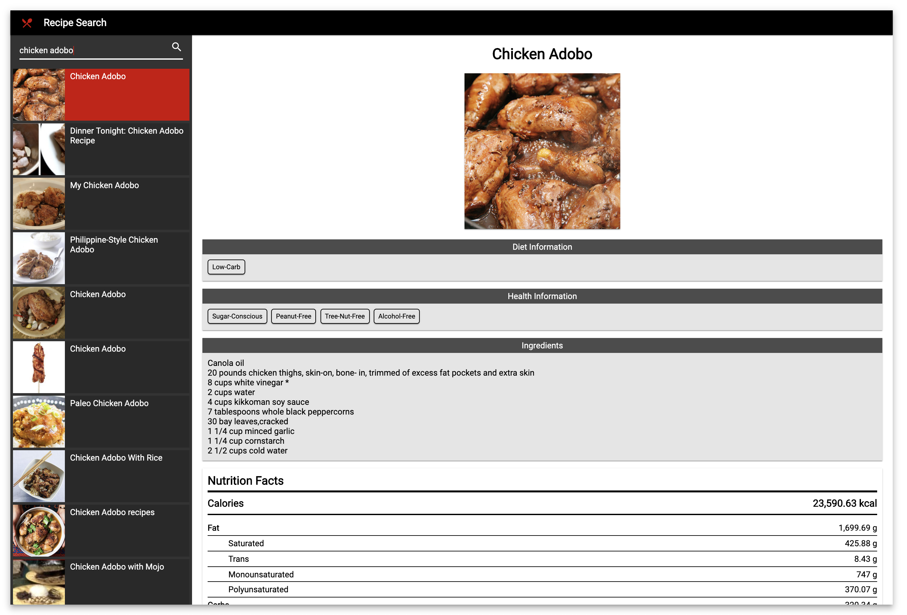

# Recipe Search

This project was generated with [Angular CLI](https://github.com/angular/angular-cli) version 8.2.1.

## Preview

## Prerequisite

Go to `https://developer.edamam.com/edamam-recipe-api` and sign up for `Recipe Search API`.  Once signed up, create a new application to get your `Application ID` and `Application Keys`.

Update the `app_id` and `app_key` in `environment.ts`.

## Installation

Run `npm install` to install the necessary packages.

## Development server

Run `ng serve` for a dev server. Navigate to `http://localhost:4200/`. The app will automatically reload if you change any of the source files.

## Build

Run `ng build` to build the project. The build artifacts will be stored in the `dist/` directory. Use the `--prod` flag for a production build.
