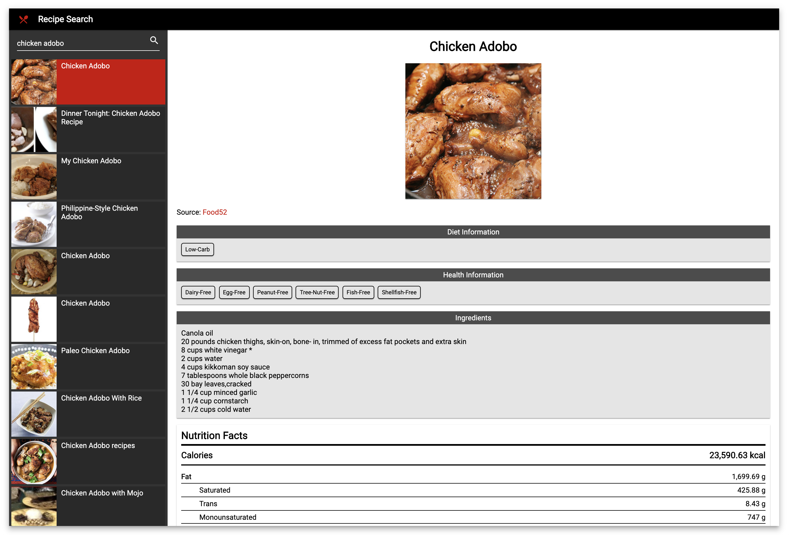

# Recipe Search

This project was generated with [Angular CLI](https://github.com/angular/angular-cli) version 8.2.1.

## Preview
[Live Demo](https://stackblitz.com/github/raemounz/recipe-search)

## Prerequisite
Sign up to Edamam's <strong>Recipe Search API</strong> in `https://developer.edamam.com`.  Then update the `app_id` and `app_key` in `environment.ts`.

## Installation

Run `npm install` to install the necessary packages.

## Development server

Run `ng serve` for a dev server. Navigate to `http://localhost:4200/`. The app will automatically reload if you change any of the source files.

## Build

Run `ng build` to build the project. The build artifacts will be stored in the `dist/` directory. Use the `--prod` flag for a production build.
